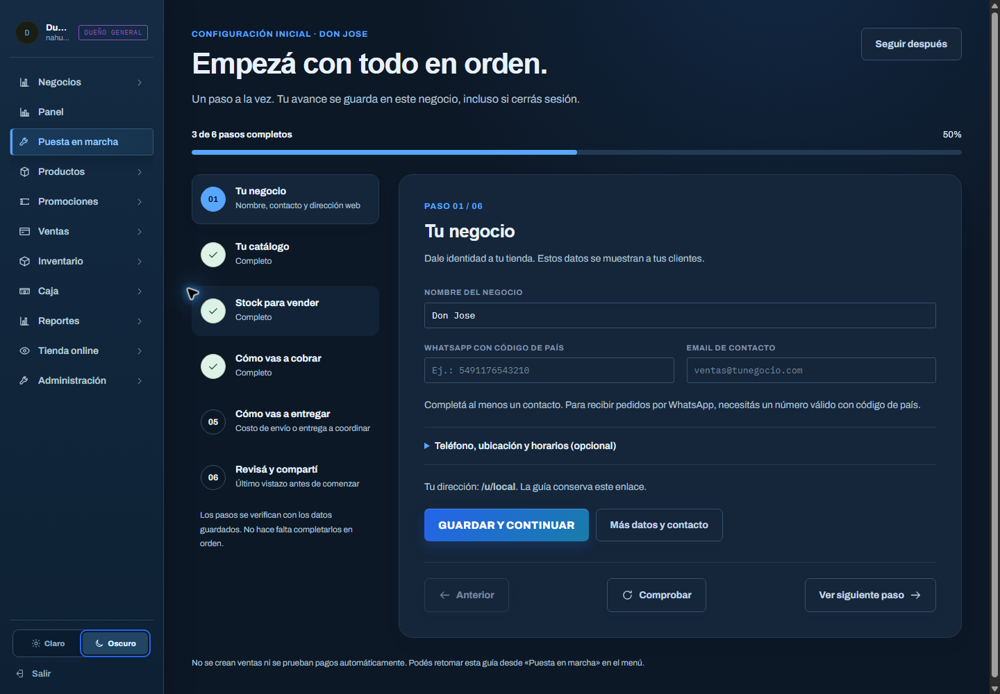
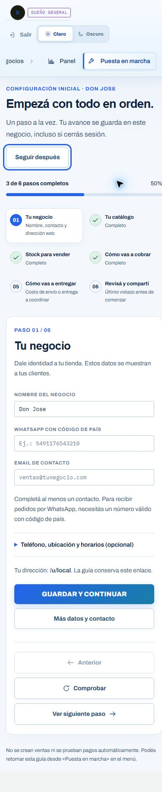

# Validación de puesta en marcha — revisión local

Fecha: 2026-10-03. Sin commit, push ni despliegue.

## Resultado

- `npm run lint`: correcto.
- `npm run build`: correcto. Sigue la advertencia previa de tamaño del paquete
  del Dashboard (aproximadamente 762 kB antes de gzip); no impide compilar.
- `git diff --check`: sin errores de espacios.

## Chrome

Revisión a 390, 768 y 1440 píxeles, con temas claro y oscuro. Se corrigió un
desborde del botón del encabezado a 768 px y se habilitó el desplazamiento del
menú del panel en móvil. Sin desbordamiento horizontal del documento al terminar.

Comprobados: navegación entre pasos con teclado, foco visible, movimiento
reducido, pausa y reanudación, último paso conservado tras recargar, acceso al
catálogo y regreso a la guía, bloqueo de finalización incompleta, copiar el
enlace y abrir la tienda del negocio seleccionado. Sin errores ni advertencias
de consola en la revisión final. Se restauraron el tamaño normal del navegador
y el tema oscuro que estaba seleccionado.

El flujo completo de guardado/finalización, sesiones nuevas, roles, slugs,
aislamiento de comercios, stock, productos ocultos y conservación de claves se
revisó por HTTP contra el entorno local. No se
rellenaron contactos ficticios ni se cambiaron cobros, productos o entregas del
comercio abierto en Chrome. En ese comercio siguen pendientes el contacto y la
confirmación de entregas, además de la revisión final; la navegación solo guardó
el paso y la pausa/reanudación de su guía.

No se verificó una transacción real ni la validez de las credenciales ante
Mercado Pago. El indicador de la guía comprueba presencia de Access Token y
clave de webhook, tal como se aclara en pantalla.

## Capturas

